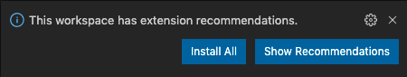

# vimeo-example

This codebase demonstrates basic usage of the [Vimeo Node API](https://github.com/vimeo/vimeo.js/ 'https://github.com/vimeo/vimeo.js/').

> _See [the Vimeo API documentation](https://developer.vimeo.com/api/guides/start 'https://developer.vimeo.com/api/guides/start') for reference._

## Project setup

1. Install Dependencies with **`npm ci`**

2. [Install VSCode](https://code.visualstudio.com 'https://code.visualstudio.com')

3. Install VSCode Extension Recommendations



4. Set Environment Variables

    - Copy/paste the contents of [`.env-example`](./.env-example './.env-example') into a new `.env` file in the project root.
    - **Do not commit the `.env` file!**
    - Set the values for these variables:

        - client id
        - client secret
        - access token
        - user id

5. Run the code with **`npm start`**

## Commands

<details>
<summary>Local Testing</summary>
<p>
Start the application

```
npm start
```

</p>
</details>

<details>
<summary>QA</summary>
<p>
Run unit tests

```
npm test
```

Run linting

```
npm run lint
```

</p>
</details>

<details>
<summary>Deployment</summary>
<p>
Create a local build

```
npm run build
```

Delete the local build

```
npm run clean
```

</p>
</details>
